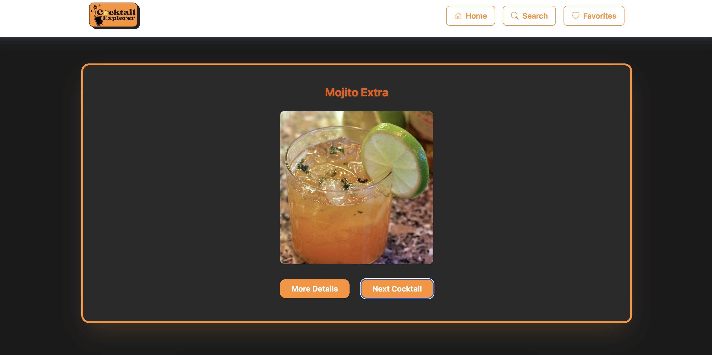

# 🍹 Cocktail Explorer

A sleek and responsive JavaScript web app that connects to [TheCocktailDB API](https://www.thecocktaildb.com/) to let users discover cocktails.  
You can get random drinks, search by name, view full cocktail details – and save your favorites in local storage.

---

## 🚀 Live Demo

👉 [View the app on Netlify](https://kaigan-cocktail-app.netlify.app/)

---

## 🧰 Features

- 🎲 Get a random cocktail on load
- 🔍 Search cocktails by name
- 📋 View detailed cocktail info: name, image, category, glass, ingredients, and instructions
- 💾 Add/remove favorites (stored in localStorage)
- 📱 Responsive layout with mobile-first design
- 🍔 Hamburger menu with blur + dark overlay
- ✨ Smooth animations using Tailwind and custom classes

---

## 🖼️ Screenshot

Here’s a preview of the app running locally:



---

## 🛠️ Tech Stack

- **HTML5**
- **CSS3**
- **Tailwind CSS**
- **Vanilla JavaScript (ES6)**
- **[TheCocktailDB API](https://www.thecocktaildb.com/api.php)**
- **Bootstrap Icons**

---

## 💻 How to Run Locally

```bash
git clone git@github.com:kaigan94/cocktail-api-project.git
cd cocktail-api-project
