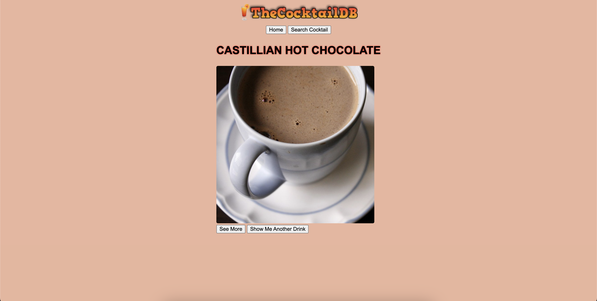

# 🍹 Cocktail API Project

This is a small JavaScript web app that connects to [TheCocktailDB API](https://www.thecocktaildb.com/) to let users explore cocktails.  
You can fetch random drinks, search by name, and view full cocktail details like ingredients and instructions.

---

## 🚀 Live Demo

👉 [View the app on Netlify](https://kaigan-cocktail-app.netlify.app/)

---

## 🧰 Features

- 🎲 Get a random cocktail on load
- 🔍 Search cocktails by name
- 📋 View detailed cocktail info: image, category, glass, ingredients, and instructions
- 🔄 Refresh to get another random drink
- Responsive, mobile-friendly layout

---

## 🖼️ Screenshot

Here’s a preview of the app running locally:



---

## 💻 Tech Stack

- HTML5
- CSS3
- JavaScript (ES6)
- [TheCocktailDB API](https://www.thecocktaildb.com/api.php)

---

## 🧪 How to Run Locally

1. Clone the repository:
   ```bash
   git clone git@github.com:kaigan94/cocktail-api-project.git
   cd cocktail-api-project
   ```
